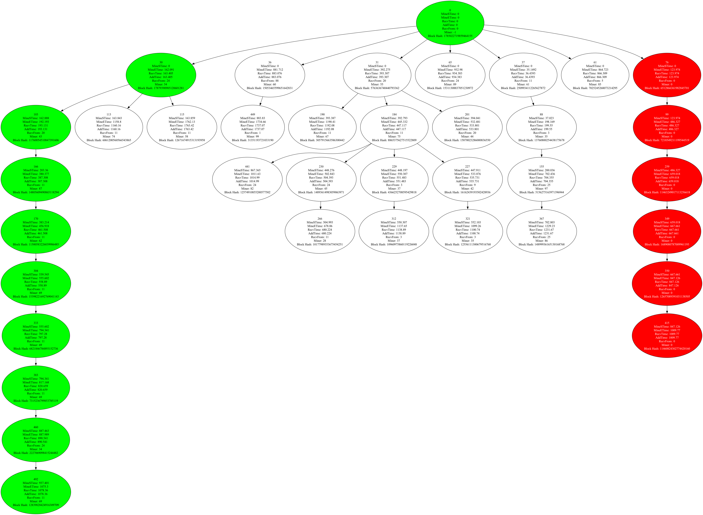
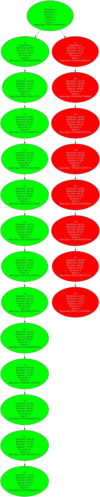
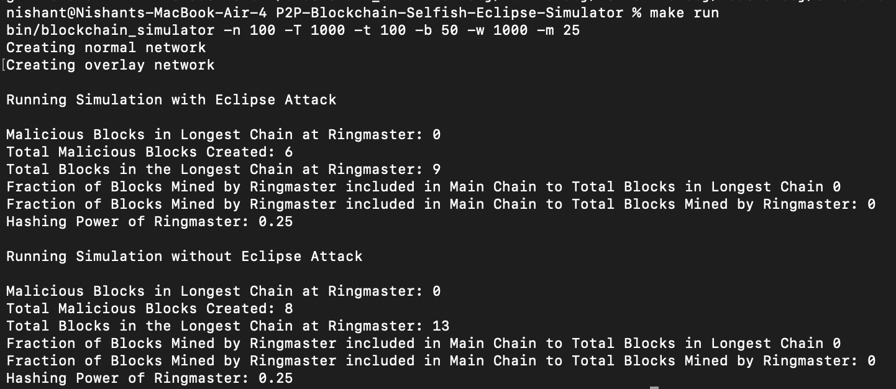

# P2P Blockchain Selfish Eclipse Simulator

Discrete Event Simulator to simulate the impact of selfish mining with eclipse and selfish mining without eclipse attacks on the longest chain or canonical chain generated at end of simulation. And also how various parameters like timeout timer etc impacts it.


## Features

- Discrete Event Simulation 
- 2 step block propagation mechanism.
- Hash based broadcasting
- Timeout mechanism
- Separate Overlay Network of malicious nodes
- Selfish mining with eclipse and without eclipse
- Combine hashing power of all malicious node
- Analysis of Blockchain statistics
## Tech Stack

**C++**: The core language used to create the project.

**Matplotlib**: Used for visualization of blockchain tree after end of simulation.  

## Run Locally

Clone the project

```bash
  git clone https://github.com/menishantsharma/P2P-Blockchain-Selfish-Eclipse-Simulator
```

Go to the project directory

```bash
  cd P2P-Blockchain-Selfish-Eclipse-Simulator
```

Build the project

```bash
make
```

Run the Simulation

```bash
make run
```

Clean build artifacts

```bash
make clean
```

- Parameters are set in makefile. To set them change the makefile.

-  `-n`: Total Number of nodes
- `-b`: Mean block interarrival time.
- `-T`: Total simulation time (in seconds).
- `-w`: Timeout time (in seconds).
- `-m`: Percentage of malicious nodes.

## Screenshots

**Ringmaster blockchain With Eclipse**



**Ringmaster blockchain Without Eclipse**





## Authors

- **Nishant Sharma** - MTech CSE Student at IIT Bombay
- **Github** - [@Nishant Sharma](https://github.com/menishantsharma)


## License

[MIT](https://choosealicense.com/licenses/mit/)